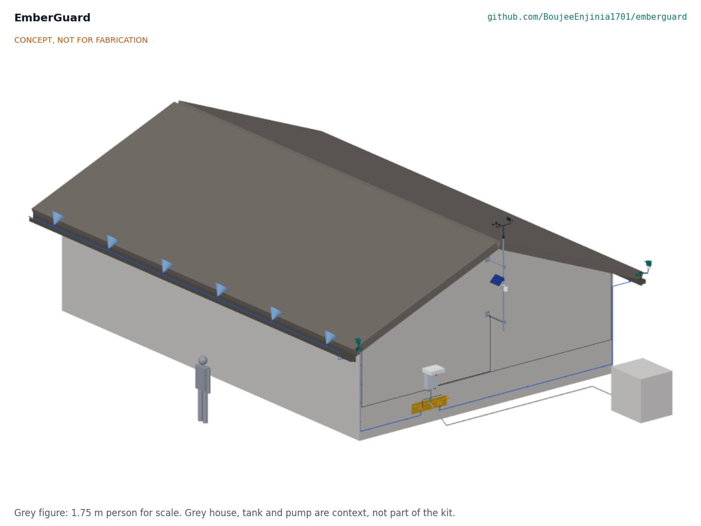

# EmberGuard

  

**Area:** Situational Field Hardware · **TRL:** 3 of 9 (proof of concept on paper) · **Prototype budget:** $605 USD · **Difficulty:** 3 of 5

Roof-edge sensor mast that detects ember showers with IR and wind data and triggers a gutter and eave sprinkler zone.

[Interactive 3D model](media/viewer.html) · [Concept blueprint (PDF)](media/concept-blueprint.pdf) · [General arrangement EGD-DWG-001 (PDF)](cad/drawings/EGD-DWG-001.pdf) · [Sizing calculations](docs/04-calcs/01-sizing.md) · [Review note](docs/REVIEW.md)

## Concept rationale

Most houses lost in wildland fires are lit by embers that lodge in gutters and at roof edges, often hours before or after the flame front and while the house is empty. EmberGuard therefore aims small and early: two low-cost thermal arrays look straight along the gutters from pods at their ends, a weather mast decides when fire weather has arrived, and a 4 L/min micro-sprinkler line wets only the strip where embers collect. Sensing embers rather than running on a timer keeps water use within a household tank and away from the hydrant supply that fire crews need.

The design is open and garage-buildable because the people most exposed are often the least able to buy a commercial exterior sprinkler system. Every part is an off-the-shelf sensor, irrigation valve or weather-station spare, the kit runs on 12 V with no mains work or roof penetrations, and the calculations, model and bill of materials are published so that neighbourhood groups, fire agencies and researchers can check the claims and the misses.

## Burning platform

Extreme wildfires are becoming more common. The UN Environment Programme projects a global increase in extreme fires of up to 14 % by 2030, 30 % by 2050 and 50 % by 2100 ([UNEP, 2022](https://www.unep.org/news-and-stories/press-release/number-wildfires-rise-50-cent-2100-and-governments-are-not-prepared)). At the same time more homes sit where fire can reach them: in the United States the wildland-urban interface grew from 30.8 million to 43.4 million homes between 1990 and 2010, a 41 % increase ([Radeloff et al. 2018, *PNAS*](https://doi.org/10.1073/pnas.1718850115)).

Embers are what turn a wildfire into a town fire. In the 2018 Camp Fire, showers of burning debris carried ahead of the main fire ignited buildings in Paradise, California; the fire killed 85 people and destroyed more than 18,000 buildings ([NIST, 2021](https://www.nist.gov/news-events/news/2021/02/new-timeline-deadliest-california-wildfire-could-guide-lifesaving-research)). Australia's 2019 to 2020 bushfires destroyed more than 3,000 homes ([Royal Commission into National Natural Disaster Arrangements, 2020](https://naturaldisaster.royalcommission.gov.au/publications/html-report/foreword)).

## Where it could be used

### By industry

| Industry | Use |
| --- | --- |
| Residential housing in fire-prone areas | Automatic wetting of gutters and eaves while the household is evacuated |
| Home insurance and mitigation programmes | An open, auditable reference design for studying low-cost ember defense retrofits |
| Agriculture and wine | Protecting sheds, barns and packing houses on tank water at the edge of bush or forest |
| Tourism and parks | Unattended lodges, huts and campground buildings in forest settings |
| Wildfire research | Logged ember arrival times, wind and valve actions from individual houses |

### By country or region

| Country or region | Why it matters there |
| --- | --- |
| United States (California and the West) | The Camp Fire destroyed more than 18,000 buildings, many ignited by embers blown ahead of the front ([NIST, 2021](https://www.nist.gov/news-events/news/2021/02/new-timeline-deadliest-california-wildfire-could-guide-lifesaving-research)) |
| Canada | More than 6,000 fires burned about 15 million hectares in 2023, over twice the previous record ([Natural Resources Canada](https://natural-resources.canada.ca/stories/simply-science/canada-s-record-breaking-wildfires-2023-fiery-wake-call)) |
| Australia | The 2019 to 2020 bushfires destroyed more than 3,000 homes ([Royal Commission, 2020](https://naturaldisaster.royalcommission.gov.au/publications/html-report/foreword)); many rural homes rely on tank water |
| Chile | Fires around Viña del Mar in February 2024 killed at least 122 people by 5 February ([UN Connecting Business initiative](https://www.connectingbusiness.org/ourwork/emergencies/chile-wildfires-2024)) |
| South Africa | The 2017 Knysna fires destroyed or damaged 1,059 formal and 385 informal homes, with ember attack igniting secondary fires across rivers and highways ([*International Journal of Disaster Risk Reduction*, 2023](https://www.sciencedirect.com/science/article/pii/S2212420923000985)) |
| Greece (Mediterranean Europe) | The July 2018 fire in the seaside village of Mati, near Athens, killed at least 98 people and destroyed thousands of houses and vehicles ([European Parliament, 2018](https://www.europarl.europa.eu/doceo/document/B-8-2018-0391_EN.html); [NOAA Climate.gov, 2018](https://www.climate.gov/news-features/event-tracker/strong-winds-whip-deadly-wildfires-greece-late-july-2018)) |

## What sparked the idea

The idea traces back to the survey that CSIRO building researchers made after the Ash Wednesday bushfires of 16 February 1983. Caird Ramsay and colleagues examined some 1,150 burnt and surviving houses in the Otway Ranges and found that houses were most often set alight by burning debris, embers of bark, twigs and leaves borne on the wind, lodging in gaps, at ridges and at gutters. They also found that people played a significant role in house survival, because a few buckets of water and wet mops were enough if a small fire was attacked early ([CSIRO, *Ecos* 43, 1985](https://www.aidr.org.au/media/4774/ecos_lessons-from-ash-wednesday.pdf)). EmberGuard asks whether a machine can supply that small, early wetting at the places where embers lodge, so that nobody has to stay behind to do it.

## Problem

Wildfire embers ignite homes well ahead of the fire front, most often in gutters, on roof edges and in debris near the eaves, while the house is empty and the power may be off. Commercial exterior sprinkler systems exist but are costly and closed, and timer-based sprinklers waste water that fire crews need.

## Concept

Roof-edge sensor mast that detects ember showers with IR and wind data and triggers a gutter and eave sprinkler zone.

Two small sensor pods at the gable-end corners of the gutters each hold a thermal array camera that looks straight along its gutter, and a slim weather mast at the gable carries an anemometer, wind vane, humidity sensor and solar panel. The system arms itself in fire weather, and when a pod sees a hot spot or a burst of hot specks it sprays the gutter lips at a steady 4 L/min, running only the leeward line in wind. It runs for three days armed on a small LiFePO4 battery with solar top-up.

The TRL 3 calculations (EGD-CAL-001 v0.3) confirm about 965 L per 4 h ember event, water at the farthest head within 55 s, a battery with a wide margin and a strong mast, and show that the pods see the inside of each open gutter along its length. They also show that hanger straps hide deep gutter debris beyond about 8 m, that single embers are caught to 8.8 m only when centred in a pixel, that the leeward eave still gets too little water in the design wind, The priced kit costs $605, which the budget Amish approved on 2026-09-26 now covers. The other findings are open questions for the next revision, listed in the [review note](docs/REVIEW.md).

Full design precis: [docs/02-concept.md](docs/02-concept.md)

## Key components

- Gable-end weather mast
- Two gutter-corner sensor pods with heat hoods, each with a thermal array sensor (32 x 24 pixels)
- Anemometer, wind vane, temperature and humidity sensor
- Controller with 12.8 V 10 Ah LiFePO4 battery and 10 W solar panel
- Two 12 V normally closed zone valves and a pressure transducer
- Pump-start dry contact for an existing pump
- Micro-sprinkler lines on both gutter lips
- Mast earthing kit

The priced bill of materials is in [bom/bom.csv](bom/bom.csv). The parametric model is `cad/src/model.py`, with STEP and STL exports in `cad/step/` and `cad/stl/`.

## Safety

> Not a substitute for evacuation orders, home hardening or professional fire protection. Leave when told to leave. Installation involves work at height. The kit is 12 V DC only; a mains pump keeps its own certified controls. The LiFePO4 battery must be fused and enclosed, and the mast must be earthed against lightning. See the safety section of the precis.

## Repository layout

| Folder | Contents |
| --- | --- |
| `docs/` | Problem, concept, requirements, calculations and design decisions |
| `cad/src/` | build123d Python source, the source of truth for all geometry |
| `cad/step/`, `cad/stl/` | Exported models for FreeCAD, other CAD tools and printing |
| `cad/drawings/` | 2D sketches and dimensioned drawings |
| `bom/` | Bill of materials |
| `electronics/` | KiCad schematics and PCB layouts |
| `firmware/` | Microcontroller code |
| `media/` | Renders, perspectives and photos |
| `build-log/` | Dated prototyping notes |

## Documentation

Controlled documents follow the portfolio [documentation standard](.kit/STANDARDS.md). Each carries a document ID (EGD-PRC-001 for the precis), a version and a revision history. Branded PDFs are built with `python .kit/render.py` and attached to GitHub Releases when a document is tagged, for example `EGD-PRC-001/v1.0`.

## Credits

Designed by Amish Chadha, with contributions from Ashok Kumar Chadha. See [CONTRIBUTORS.md](CONTRIBUTORS.md) for roles. To cite this design, use [CITATION.cff](CITATION.cff) (GitHub shows it as "Cite this repository").

AI assistance (Claude) was used to accelerate concept renders, prototype documentation and first-pass sizing calculations. Design direction and all decisions are Amish Chadha's, recorded in this repository's decision records (`docs/decisions/`).

## Licenses

- **Hardware** (CAD, drawings, BOM, electronics): [CERN-OHL-S v2](LICENSE)
- **Software** (firmware, scripts, notebooks): [MIT](LICENSE-SOFTWARE)

A project of the [Design Molecule](https://designmolecule.com) lab.
