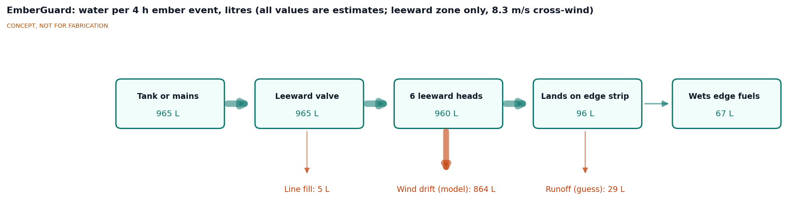
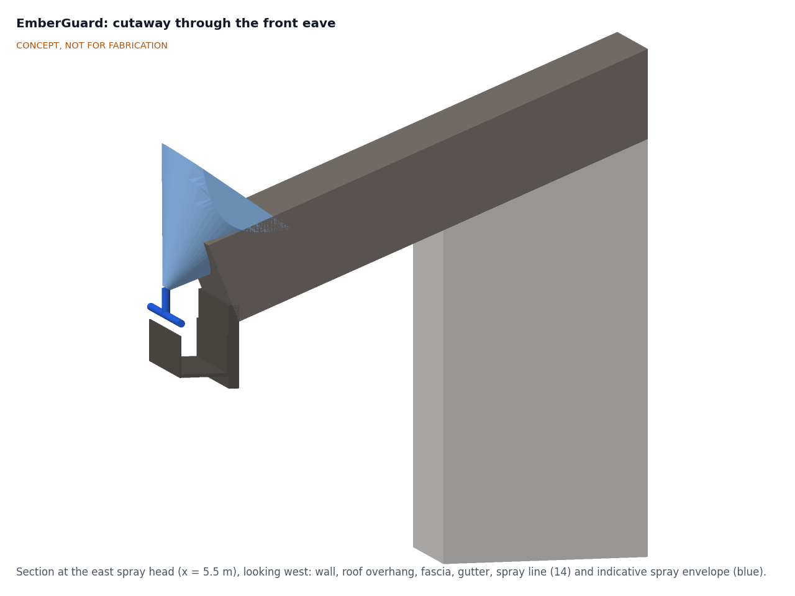
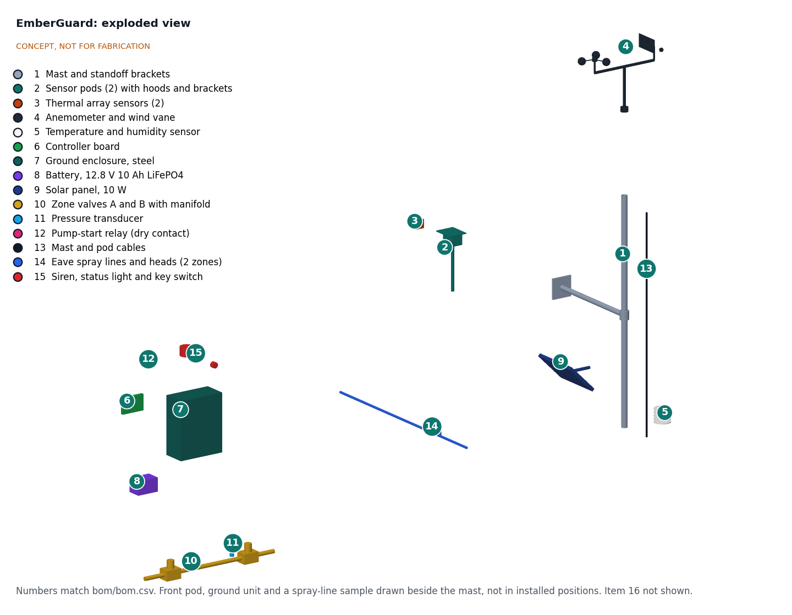

# EmberGuard design precis

EmberGuard pairs a slim weather mast at one gable end with two small thermal sensor pods at the gable-end corners of the gutters. Each pod sits 200 mm beyond the end of its gutter and 500 mm above the lip and looks straight down the gutter, so a 32 x 24 pixel thermal array sees the debris inside it and the first metre of roof. The mast carries a cup anemometer, a wind vane, a humidity sensor and a small solar panel, and they decide when fire weather has arrived. When the system is armed and sees a hot spot or a burst of hot specks, it opens 12 V valves feeding a line of micro-sprinklers clipped to each gutter lip, wetting the gutter, fascia and first metre of roof. In wind, only the leeward line runs. The TRL 3 calculations (EGD-CAL-001 v0.2) confirm a steady 4 L/min draw, about 965 L per 4 h ember event, water at the farthest head 55 s after detection, a battery with a wide margin and a strong mast. They also show what is still missing. Hanger straps across the gutter shadow debris that sits deep in it beyond about 8 m. A 600 °C ember reaches the 2 K trigger to 8.8 m only when it is centred in a pixel. The leeward eave still gets far less than 5 mm/h in the 30 km/h design wind. The priced kit costs $605 against the $575 budget Amish set on 2026-09-25. The general arrangement is drawing EGD-DWG-001 Rev P2 (`cad/drawings/EGD-DWG-001.pdf`), generated from `cad/src/model.py`. This revision records the recommendations Amish accepted on 2026-09-25 (EGD-DDR-002): the pods replace the ridge-line sensor head, which could not see into the gutters at all.

*Figure 1. EmberGuard on the 12 x 8 m reference house, with a 1.75 m person for scale. Weather mast at the east gable, a sensor pod at the east end of each gutter, ground unit and valves on the gable wall, spray lines on both gutters (front spray envelopes shown in blue). Grey house, tank and pump are context. Rendered from the parametric model.*

## How it works

1. **Watch.** Outside fire weather the controller samples wind, wind direction, air temperature and humidity once a minute and sleeps between samples.
2. **Arm.** It arms when sustained wind reaches 30 km/h (or gusts 50 km/h) with relative humidity at or below 20 % for 10 min, or when the owner arms it by key switch or phone. These defaults resemble common Red Flag conditions, which vary by region, and are adjustable. Once armed, it stays armed for at least 6 h and runs both pod sensors at 4 frames per second.
3. **Detect.** Each sensor's frames are compared with a slowly updated background. Two patterns count as embers:
   - a **persistent hot spot**: a cluster of 1 to 4 pixels at least 2 K above its background for 5 s or more (decided, EGD-DDR-002, O5; was 5 K), which is what a landed ember or smouldering debris looks like;
   - an **ember shower**: 10 or more short hot flickers per minute across the view, from embers in flight or bouncing on the roof.
   Sun-heated roofing warms slowly and over large areas, so it is rejected by the small-cluster and rate-of-rise tests.
4. **Wet.** On a detection, the valve on the side of the detection opens first so its line fills within 47 to 55 s at 4 L/min (EGD-CAL-001, C3). In calm air the zones then alternate every 30 s. When the wind vane and anemometer show more than 2 m/s of wind across the eaves, only the leeward zone runs, continuously at 4 L/min, because wind drift starves the leeward eave; a detection on the windward side returns the system to alternating zones (decided, EGD-DDR-002, O4; EGD-CAL-001, C10). Either way the supply sees a steady 4 L/min. Spraying continues until 30 min after the last detection. A pressure transducer confirms that water is flowing; a dry-contact relay can start a pump that runs on its own supply.
5. **Fail safe.** If sensor data stops while armed (for example a pod is damaged by heat), the controller assumes the worst and sprays in the same cycle until the battery or water runs out. Loss of controller power closes the normally closed valves, which saves the tank.
6. **Tell.** A siren and status light at the ground unit, and a phone alert when a network is available, report arming, spraying and faults. An event log records detections, wind and valve actions for later study.

*Figure 2. Water per 4 h ember event in the 30 km/h design wind. All values are estimates: the six leeward heads at 40 L/h running continuously under the leeward-only rule, wind drift from the screening model in EGD-CAL-001 v0.2 at an 8.3 m/s cross-wind (10 % on target on the leeward eave), and a guess at runoff from the gutter and roof edge. The figure shows why R6 is still not met.*

## Main components

Table 1. Main components. Numbers match `bom/bom.csv` and Figure 4. Items 16 and 17 are not modelled.

| # | Component | Proposed choice | Notes |
| --- | --- | --- | --- |
| 1 | Mast and standoff brackets | 40 x 2 mm 6061-T6 aluminium tube, 2.45 m, two 700 mm DN25 galvanized pipe standoffs to the gable wall | Carries the weather sensors and solar panel; top 4.70 m above ground |
| 2 | Sensor pods (2) with hoods and brackets | Die-cast aluminium box about 100 x 80 x 70 mm with a stainless hood and a small pod node that digitizes the sensor; post and arm clamped to the gutter end and fascia corner (decided, EGD-DDR-002, O3) | Pod 200 mm beyond the gutter end, 500 mm above the lip, over the gutter centreline |
| 3 | Thermal array sensors (2) | MLX90640 BAB, 32 x 24 pixels, 55 x 35 degree field of view (decided, D2), one in each pod | Aimed along the gutter, 10 degrees toward the house and 5 degrees down |
| 4 | Anemometer and wind vane | Weather-station cup anemometer (pulse) and vane on a 460 mm crossarm | On the mast top, 5.0 m above ground, clear of the ridge |
| 5 | Temperature and humidity sensor | Digital sensor in a five-plate radiation shield | On the mast, clear of spray |
| 6 | Controller boards | Ground controller (ESP32 class) with valve drivers, linked over RS-485 to the two pod nodes | Firmware beyond a labelled sketch is TRL 4 work |
| 7 | Ground enclosure | Steel IP65 box about 160 x 320 x 400 mm on the gable wall at 1 m, light-coloured | Steel for heat and ember resistance; light finish and shade for battery temperature |
| 8 | Battery | 12.8 V 10 Ah LiFePO4 with built-in BMS (decided, EGD-DDR-002, O5) | About 128 Wh nominal, 115 Wh usable |
| 9 | Solar panel | 10 W panel on the mast with a LiFePO4 charge controller | Keeps the battery full between events; no credit taken during smoke |
| 10 | Zone valves A and B | Two 12 V DC normally closed solenoid valves on a small manifold (decided, D9) | Front and back eave; closed on power loss; zero-minimum-pressure type |
| 11 | Pressure transducer | 0 to 10 bar, 0.5 to 4.5 V | Confirms water flow; warns of a dry supply |
| 12 | Pump-start relay | Isolated dry contact | Signals the pump's own certified controls; no mains inside EmberGuard |
| 13 | Mast and pod cables | Shielded outdoor cables; heat sleeve at each pod | Mast: wind, humidity and solar; pods: power and RS-485 |
| 14 | Eave spray lines and heads | 16 mm UV-stable polyethylene line clipped to each gutter lip, six micro-sprinklers per eave, risers down the gable wall; 17.7 m and 21.3 m per zone | Metal eave runs decided if the budget allows (D4); it does not, so they are a $110 priced option |
| 15 | Siren, status light and key switch | 12 V siren, LED beacon, keyed arm switch | Key switch also disarms |
| 16 | Hardware and fittings | Clamps, fittings, glands, fuses | Not modelled |
| 17 | Mast earthing kit | Earth rod, clamp, conductor and mast bond | Added at TRL 3 for lightning protection; not modelled |

*Figure 3. Section through the front eave at the east spray head, looking west: wall, roof overhang, fascia, gutter, spray line and head (14) on the gutter lip, and the indicative spray envelope over the gutter and roof edge.*

*Figure 4. Exploded view with BOM numbers. The front sensor pod, the ground unit and a 1.4 m sample of spray line are drawn beside the mast, not in their installed positions.*

## Numbers checked at TRL 3

All values come from EGD-CAL-001 v0.2 (`docs/04-calcs/sizing.py`); the tags in brackets are its output lines. They are paper estimates.

Table 2. Key numbers.

| Quantity | Value | Basis | Requirement |
| --- | --- | --- | --- |
| Pixel footprint | 0.24 x 0.20 m at 8 m, 0.42 x 0.36 m at 14 m | 1.72 x 1.46 degree pixels [A1] | |
| Pod position | 200 mm beyond the gutter end, 500 mm above the lip (2.97 m above ground) | Model [A2] | |
| Gutter interior in view | 1.25 m to 12.95 m from the gutter end, both gutters (open gutter); range 1.5 to 13.1 m | Line of sight on the model [A3], [A5] | R3 met |
| Hanger straps every 750 mm | Debris 42 mm below the lip seen at 35 of 118 stations, none beyond 7.8 m; debris within 10 mm of the lip seen at 95 of 118 | [A4] | R1 **at risk** |
| Grazing angle on the debris | 7.4 degrees at 4 m, 3.8 degrees at 8 m, 2.4 degrees at 13 m | [A6] | |
| Former ridge-line head | Debris seen at 0 of 130 stations | [A7] | |
| 100 cm² spot at 300 °C | Flat on the debris: 6.7 K at 8 m, 1.6 K at 13 m; reaches the 2 K trigger to 12.1 m. Debris face 100 x 50 mm: 43 K at 8 m, seen to 41 m | 2 K trigger [B9] to [B11] | R1 **at risk** |
| 10 mm ember, 600 °C | Reaches 2 K to 8.8 m centred in a pixel, 4.4 m on a pixel corner (5.5 m and 2.8 m at the former 5 K) | [B6], [B7] | R2 **at risk** |
| Flow and application | 4 L/min per zone; 15.4 mm/h while running | [C1] | |
| Line fill | Water at the farthest head 47 s (A) and 55 s (B) after detection | Detection-side zone first [C3] | R5 met |
| Supply pressure | About 2.3 bar at the manifold | Friction and 2.1 m lift [C4] | |
| Water per event | 965 L (255 US gal) | 4 h at 4 L/min plus line fill [C5] | R7 met, 3.5 % margin |
| Net wetting, leeward-only rule | Leeward eave 1.5 mm/h at 8.3 m/s (0.8 mm/h alternating) and 5.1 mm/h at 4.2 m/s; windward eave dry until a windward detection, then 7.4 mm/h | Droplet screening model [C7], [C10] | R6 **not met** |
| Energy | 54.4 Wh for 72 h armed plus 13.1 Wh for 4 h spraying = 67.5 Wh | 0.76 W armed, 3.24 W spraying [D2] to [D4] | |
| Battery | 115.2 Wh usable at 25 °C, 103.7 Wh at 0 °C, 92.2 Wh at end of life | 12.8 V 10 Ah LiFePO4 [D4] | R8 met |
| Pump on its own battery (studied) | About 57 W, 229 Wh per event; a 25 Ah LiFePO4 pack or one SwapCell pack (1.6 events) | [D7] to [D9] | Out of kit scope (D6) |
| Mast at 120 km/h | 174 N; 31 N·m at the upper standoff; 14 MPa (factor 16.6) | [E2], [E3] | R10 wind met |
| Standoffs | 153 N reaction; 50 MPa in DN25 pipe (factor 4.7); about 535 N per wall anchor | [E4] | |
| Enclosure in sun at 60 °C | About 71 °C (mid-grey), 65 °C (light) | [F1], [F2] | R10 at risk |
| Kit parts cost | $605 against $575 | `bom/bom.csv` [G1] | R13 **not met** |

## Key design choices

Amish decided the TRL 2 review items on 2026-09-25 by accepting each recommendation (EGD-DDR-001), and later the same day accepted the recommendations left open after TRL 3 (EGD-DDR-002). The choices below are therefore decided.

- **Thermal arrays, not simple flame sensors (decided, D2).** Near-infrared flame sensors respond to flames and sunlight and cannot say where a hot spot is. A 32 x 24 thermal array locates hot spots, measures their size and ignores sun-warmed roofing.
- **Watch the gutter from its end (decided, O3).** Landed embers and smouldering debris persist for seconds to minutes and are what actually ignites a house, and gutters are where they collect. A sensor above the ridge cannot see into a gutter behind the eave. A pod beyond the gutter end looks straight along it. Hanger straps still hide deep debris far from the pod.
- **Arm on weather, trigger on embers (decided, D7 and O5).** Adjustable defaults of 30 km/h sustained or 50 km/h gusts with humidity at or below 20 % for 10 min, plus manual and remote arming, reviewed with a local fire agency. Persistent-spot trigger 2 K, ten times the sensor noise at 4 Hz; its false-trigger rate needs recorded thermal video (TRL 4, on hold).
- **Weather mast at the gable end (decided, D3).** The mast now carries only the wind, humidity and solar parts, clear of the ridge.
- **Leeward zone in wind (decided, O4).** Two zones halve the peak flow so a small pump can keep up, and suit a 1,000 L tank (decided, D5). In wind only the leeward zone runs, because drift starves it; the windward eave then relies on its own detections.
- **Low-voltage kit, pump by dry contact (decided, D6).** No mains wiring on the house; the pump keeps its own certified controls and its own power, provided by the homeowner.
- **Fail to wet on sensor loss (decided, D8), fail closed on power loss (decided, D9).** Losing a pod during the fire is likely; losing the controller should not drain the tank.
- **Battery with margin (decided, O5).** A 10 Ah pack covers 72 h armed and 4 h of spraying with 37 % to spare at end of life.
- **Polyethylene eave runs (D4).** Metal eave runs were chosen if the budget allowed; it does not, so they are a priced option.

## Safety

> **Safety:** EmberGuard is not a substitute for evacuation orders, home hardening or professional fire protection. Leave when told to leave. Never stay behind to operate, watch or repair the system during a fire.

> **Safety:** Installing the mast, sensor pods and spray lines means working at height near a roof edge. Use a stable ladder, a second person and fall protection where required; do not work on a wet or mossy roof.

> **Safety:** Water, pumps and electricity. The kit is 12 V DC only. Any mains-powered pump must keep its own certified controls and ground-fault protection; the EmberGuard relay only signals it through an isolated dry contact. Do not wire EmberGuard into mains circuits.

> **Safety:** The LiFePO4 battery is safer than other lithium chemistries but can still overheat if shorted or damaged. Use a pack with a built-in BMS and low-temperature charge cut-off, fuse the battery output, and keep the battery inside the steel enclosure. In full sun at 60 °C ambient a dark enclosure reaches about 71 °C, above the battery's rating; use a light finish and shade it.

> **Safety:** A tall metal mast on the gable is exposed to lightning. Bond it to a proper earth electrode (BOM item 17) and follow local lightning-protection practice. The wall anchors carry about 535 N each at 120 km/h; check them for each wall. The sensor pods hang beyond the gutter ends; clamp them to sound fascia and check them after storms.

> **Safety:** Automatic sprinklers on mains water can reduce pressure for firefighters. Prefer a dedicated tank; if using mains, keep the flow at or below 4 L/min and follow local fire-agency guidance.

> **Safety:** False reassurance is a hazard in itself. Gutter hanger straps hide deep debris far from the pods, the leeward eave gets little water in strong wind, the system can miss embers outside its view (vents, decks, the far gable), and it can fail in fire conditions. Keep gutters clean and harden the house as if EmberGuard were not there.

## Open questions

- [ ] How should deep gutter debris beyond the hanger-strap shadow be watched: higher pods, gutter guards as a precondition, or a narrower R1 (EGD-DDR-002, N3)?
- [ ] How can the leeward eave get 5 mm/h in the design wind: coarser or lower-angle droplets, a second row of heads, or a restated R6 (N2)? Does real recirculation behind the ridge help?
- [ ] Can a 2 K persistent-spot threshold reject sun glints, hot vents, chimneys, birds and vehicles? This needs recorded thermal video, at TRL 4 or later (on hold).
- [ ] How long do ember showers last at a single house, and is a 4 h spraying design case reasonable?
- [ ] How hot do the pods get under radiant heat and ember attack at the gutters, and for how long do they keep working?
- [ ] How can the kit come down from $605 to $575, or should the budget move again (N1)?
- [ ] Should a third sensor cover vents, decks and the far gable?
- [ ] Should EmberGuard log and share anonymised ember arrival data with WUI researchers?
